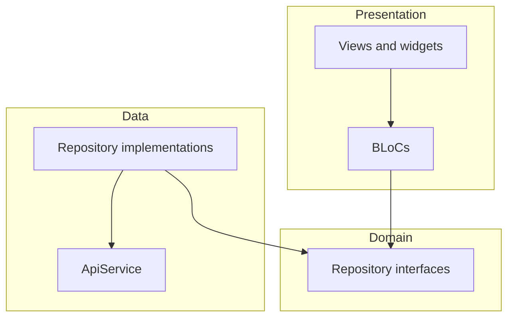

# Clean Architecture and scalability — plan (living)

## Alignment (read first)

Per **`AGENTS.md`**:

1. **`.cursor/rules/`** (index: **`.cursor/rules.mdc`**) is authoritative.
2. **`.cursor/skills/`** applies when the task matches a skill.
3. This plan **does not override** rules or skills; use it for **refactor scope and status** only.

**Product scope:** **iOS and Android** Flutter mobile (not web unless explicitly requested).

---

## Current state (repo snapshot)

The original refactor goals are **largely implemented**:

| Area | Status |
|------|--------|
| Feature-first layout | **`lib/features/<feature>/`** with `presentation/`, optional `domain/`, `data/` (e.g. login) |
| Routing | **`lib/core/routing/`** — `route_names.dart`, `app_routes.dart`, **`AppRouter`** façade |
| Navigation in views | Splash / login use **`AppRouter.replaceWithHome`** / **`replaceWithLogin`** (not raw `Navigator` in those flows) |
| Login data layer | **`LoginRepository`** interface in **`domain/repositories/`**, **`LoginRepositoryImpl`** in **`data/`**, **`LoginModel`** in **`lib/data/models/`** |
| Assets / strings | **`AppAssets`**, **`AppStrings`**, **`AppColors`** under **`lib/core/constants/`** (no `app_images.dart`) |
| API errors | **`AppToast.showError`** pattern per **`AGENTS.md`** |

**Still centralized in `AppRouter`:** `Navigator` calls live **inside** **`AppRouter`** only — that is the intended façade pattern.

---

## Original architecture intent (unchanged goal)

Three layers per feature + shared **`lib/core/`**:



---

## Routing strategy (decision recap)

- **Chosen path:** **`MaterialApp.routes`** + **`RouteNames`** + **`AppRouter`** — appropriate for current scope.
- **Optional later (`go_router`):** only if **deep links, auth guards, or nested stacks** require it. **Not** driven by web (web is out of scope for this app).

---

## Target folder shape (reference — matches current direction)

```text
lib/
  core/
    routing/           # route_names, app_routes, app_router
  constants/         # app_strings, app_colors, app_assets, app_fonts, ...
    config/
    services/
    models/            # cross-cutting models when needed
    enums/
  features/
    <feature>/
      presentation/    # view/, widgets/, bloc/
      domain/          # optional — repository interfaces
      data/            # repository impls, feature DTOs
  data/models/         # shared API models (e.g. login_model.dart)
  widgets/             # shared UI
  main.dart
```

---

## Remaining work (prioritized)

1. **Inventory / enforcement pass**  
   Grep for **`Navigator.`** outside **`lib/core/routing/app_router.dart`**, **`Text('...')`** / **`Color(`** outside allowed central files, raw asset strings in widgets; fix or track.

2. **Typography**  
   Use **`AppFonts`** directly (e.g. `AppFonts.medium(size, color)`); eliminate duplicate inline styles where a reusable style call exists.

3. **Tests**  
   **`bloc_test`** with mocked **`LoginRepository`** (and other blocs as features grow); keep **`flutter analyze`** clean.

4. **Docs and templates**  
   Ensure **`docs/plans/*.md`** and **`docs/plans.md`** align with **`lib/features/`**, **`AppAssets`**, **`AppToast`** (toastification), and **`lib/core/routing/`** (not **`lib/core/routes/`** or **`Fluttertoast`**).

5. **Optional**  
   Evaluate **`go_router`** only if mobile product needs dictate (guards, URLs, nested navigation).

---

## Risks and edge cases (reduced)

- **Large import churn** is mostly past; future moves should stay **one feature at a time** with **`dart analyze`** after each.
- **Repository + `ApiService` injection:** keep **one** `ApiService` (or documented DI) to avoid duplicate clients.
- **Auth navigation:** preserve **`pushReplacementNamed`** semantics via **`AppRouter`** so users don’t land back on login unintentionally.
- **Stateful presentation files** (e.g. login scroll/keyboard): split for readability **without** regressing landscape/portrait behavior.

---

## Non-goals

- Rewriting business rules or API contracts.
- Replacing **`flutter_bloc`**.
- Web/desktop targets unless explicitly requested.

---

## Expected outcome (maintenance mode)

- New features follow **`lib/features/`** + **`AGENTS.md`** + **`.cursor/rules/`**.
- Navigation and route names stay in **`lib/core/routing/`** with **`AppRouter`** as the widget-facing API.
- Centralized **`AppStrings`**, **`AppAssets`**, **`AppColors`**, typography helpers.
- Blocs remain testable against **repository interfaces**.
