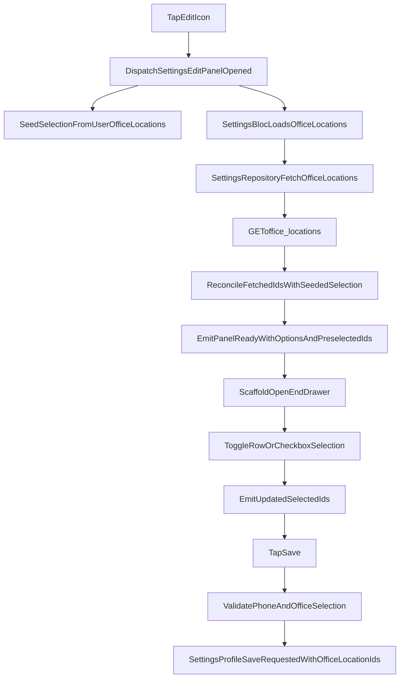

<!-- eb846930-5213-4bba-a7c9-5280e9b690ac -->
---
todos:
  - id: "add-office-location-model"
    content: "Create settings-specific office location response/model and parsing for `office-locations` API."
    status: pending
  - id: "extend-settings-repository"
    content: "Add repository contract/implementation for `fetchOfficeLocations()` with bearer token and typed mapping."
    status: pending
  - id: "add-settings-panel-state-flow"
    content: "Extend SettingsBloc events/states for open-panel signal, office-location loading, preselection, and selection toggles."
    status: pending
  - id: "replace-dialog-with-end-drawer"
    content: "Use `Scaffold.endDrawer` in settings view and trigger opening from bloc signal instead of dialog."
    status: pending
  - id: "build-office-location-multiselect-ui"
    content: "Implement white-radius dropdown with checkbox row selection and purple chips in Contact section of edit panel."
    status: pending
  - id: "add-contact-validations"
    content: "Require phone number and at least one office location before save; show validation errors in the panel form."
    status: pending
  - id: "verify-with-tests"
    content: "Add/update bloc/widget tests and run analyze + settings test suite."
    status: pending
isProject: false
---
# Settings Right Panel + Office Locations Plan

## Scope
- Replace `PersonalSettingsEditDialog` launch with a settings `endDrawer` panel.
- Fetch office locations via `GET office-locations` when the panel opens (not on dropdown tap).
- Add a new office-location response model (separate from `LoginModel`).
- Add multi-select office-location UI in the Contact section with row click + checkbox behavior and selected chips.
- Keep existing save flow (`PUT user`) and include selected `office_location_ids` in update payload.
- Add required validation in panel form: phone number is mandatory and at least one office location must be selected.
- Preselect office locations from existing user data on first settings load using `office_locations` object list and/or `office_location_ids`.

## Architecture Changes
- `settings_view.dart`
  - Add `Scaffold` key and `endDrawer` for edit panel.
  - Listen for panel-open signal from `SettingsBloc` and call `openEndDrawer()`.
- `settings_bloc.dart` + `settings_event.dart` + `settings_state.dart`
  - Add events/states for:
    - open edit panel
    - fetch office locations on panel open
    - toggle office-location selection
    - dropdown open/close state
    - consume one-shot open-drawer signal
  - On panel open event: call repository `fetchOfficeLocations()` and emit loaded/error substate.
  - Track `initialSelectedOfficeLocationIds` from `SettingsReady.user` (derived first from `officeLocations.map((e) => e.id)`, fallback to `officeLocationIds`) and reconcile with fetched options.
- `settings_repository.dart` + `settings_repository_impl.dart`
  - Add `fetchOfficeLocations()` using `ApiService.get('office-locations', bearerToken: token)`.
  - Parse to new model.
- New model file under settings feature data
  - `lib/features/settings/data/models/settings_office_location_response.dart`
  - Includes:
    - response envelope (`response_type`, `message`, `responseData`)
    - `SettingsOfficeLocation` model (`id`, `name`, etc.)

## UI Plan
- New panel widget (replace dialog usage)
  - `lib/features/settings/presentation/widgets/personal_settings_edit_panel.dart`
  - Reuse most form controls from current dialog.
  - Keep 2-column field layout.
- Contact section updates
  - Add office-location multi-select control in Contact section.
  - Control behavior:
    - Tap control to open white dropdown (`radius: 12`).
    - List rows have left checkbox and label.
    - Tapping row toggles selection (same as checkbox).
  - Selected items shown as chips:
    - text color purple
    - text size 14, medium
    - chip background purple with 0.4 alpha
- Default selected values
  - On first settings screen load, derive selected IDs from user `office_locations` objects (primary source) and fallback to `office_location_ids`.
  - When office-locations API response arrives, match those IDs with fetched list and mark matched options selected by default.
- Save payload behavior
  - Send `office_location_ids` from currently selected dropdown values in `PUT user`.
- Validation behavior
  - Block save if masked phone is empty/incomplete.
  - Block save if no office location is selected.

## Data Flow

## Concrete File Touch List
- `lib/features/settings/presentation/view/settings_view.dart`
- `lib/features/settings/presentation/widgets/settings_body.dart`
- `lib/features/settings/presentation/widgets/settings_profile_header.dart`
- `lib/features/settings/presentation/widgets/personal_settings_edit_dialog.dart` (retire or keep only as fallback)
- `lib/features/settings/presentation/widgets/personal_settings_edit_panel.dart` (new)
- `lib/features/settings/presentation/bloc/settings_bloc.dart`
- `lib/features/settings/presentation/bloc/settings_event.dart`
- `lib/features/settings/presentation/bloc/settings_state.dart`
- `lib/features/settings/domain/repositories/settings_repository.dart`
- `lib/features/settings/data/settings_repository_impl.dart`
- `lib/features/settings/data/models/settings_office_location_response.dart` (new)
- `lib/core/constants/app_strings.dart` (new labels/hints if needed)
- `lib/features/settings/data/settings_user_update_payload.dart` (re-enable and map `office_location_ids`)

## Error/401 Behavior
- Reuse existing centralized unauthorized handling.
- If office-locations call returns 401, existing `UnauthorizedSessionHandler` clears data, navigates to login, and shows unauthorized toast.

## Validation + Testing
- Unit tests for settings bloc:
  - panel open triggers office-locations fetch
  - preselection by ID works
  - row toggle updates selected IDs
  - API error path emits failure state
- Widget test for panel UI:
  - opening panel via edit icon
  - checkbox + row tap toggles
  - selected chips render with expected styles
- Run `flutter analyze` and targeted tests under `test/features/settings/`.